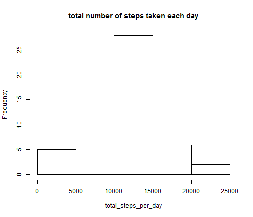
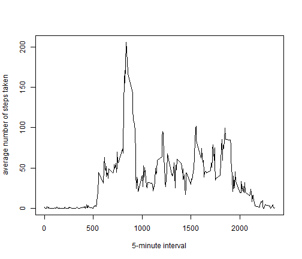
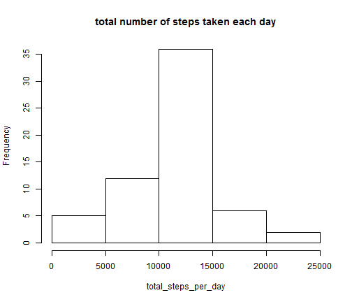
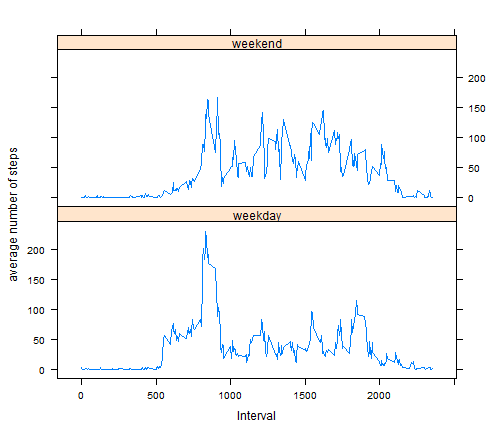

Peer Assessment 1
========================================================

### Loading and preprocessing the data


```r
fileUrl <- "https://d396qusza40orc.cloudfront.net/repdata%2Fdata%2Factivity.zip"
temp <- tempfile()
download.file(fileUrl, temp)
z <- unz(temp, "activity.csv")
data <- read.csv(z)
unlink(temp)
```


### What is mean total number of steps taken per day?  

1. Make a histogram of the total number of steps taken each day  

2. Calculate and report the mean and median total number of steps taken per day  
**The mean total number of steps taken per day is 10766.**  
**The median total number of steps taken per day is 10765.**


```r
total_steps_per_day <- tapply(data$steps, data$date, sum)
hist(total_steps_per_day, main = "total number of steps taken each day")
```

 


```r
mean(total_steps_per_day, na.rm = TRUE)
```

```
## [1] 10766
```

```r
median(total_steps_per_day, na.rm = TRUE)
```

```
## [1] 10765
```


### What is the average daily activity pattern?

1. Make a time series plot (i.e. type = "l") of the 5-minute interval (x-axis) and the average number of steps taken, averaged across all days (y-axis)

2. Which 5-minute interval, on average across all the days in the dataset, contains the maximum number of steps?  
**Interval 835, on average across all the days in the dataset, contains the maximum number of steps.**


```r
average_steps_per_5minute <- tapply(data$steps, data$interval, mean, na.rm = TRUE)
df <- as.data.frame.table(average_steps_per_5minute)
with(df, plot(as.character(Var1), Freq, type = "l", xlab = "5-minute interval", 
    ylab = "average number of steps taken"))
```

 


### Imputing missing values

1. Calculate and report the total number of missing values in the dataset (i.e. the total number of rows with NAs)  
**The total number of missing values is 2304.**

2. Devise a strategy for filling in all of the missing values in the dataset. The strategy does not need to be sophisticated. For example, you could use the mean/median for that day, or the mean for that 5-minute interval, etc.  
**I use the mean for that 5-minute interval to fill in.**

3. Create a new dataset that is equal to the original dataset but with the missing data filled in.

4. Make a histogram of the total number of steps taken each day and Calculate and report the mean and median total number of steps taken per day. Do these values differ from the estimates from the first part of the assignment? What is the impact of imputing missing data on the estimates of the total daily number of steps?  
**The mean total number of steps taken per day is 10766, and the same as before.**  
**The median total number of steps taken per day is 10766, and before is 10765.**  
**So the median changed a little bit, and there is almost no impact of imputing.**


```r
sum(is.na(data$steps))
```

```
## [1] 2304
```


```r
require(Hmisc)
imputed_data <- data
for (v in levels(as.factor(imputed_data$interval))) {
    imputed_data$steps[which(imputed_data$interval == v)] <- impute(imputed_data$steps[which(imputed_data$interval == 
        v)], mean)
}
total_steps_per_day <- tapply(imputed_data$steps, imputed_data$date, sum)
hist(total_steps_per_day, main = "total number of steps taken each day")
```

 


```r
mean(total_steps_per_day)
```

```
## [1] 10766
```

```r
median(total_steps_per_day)
```

```
## [1] 10766
```


### Are there differences in activity patterns between weekdays and weekends?

1. Create a new factor variable in the dataset with two levels - �gweekday�h and �gweekend�h indicating whether a given date is a weekday or weekend day.

2. Make a panel plot containing a time series plot (i.e. type = "l") of the 5-minute interval (x-axis) and the average number of steps taken, averaged across all weekday days or weekend days (y-axis). The plot should look something like the following, which was creating using simulated data:


```r
imputed_data$weekdays <- ifelse(!weekdays(as.Date(imputed_data$date)) %in% c("Saturday", 
    "Sunday"), "weekday", "weekend")
imputed_data_weekday <- imputed_data[imputed_data$weekdays == "weekday", ]
imputed_data_weekend <- imputed_data[imputed_data$weekdays == "weekend", ]
average_steps_per_5minute <- tapply(imputed_data_weekday$steps, imputed_data_weekday$interval, 
    mean, na.rm = TRUE)
df_weekday <- as.data.frame.table(average_steps_per_5minute)
df_weekday$weekdays <- "weekday"
average_steps_per_5minute <- tapply(imputed_data_weekend$steps, imputed_data_weekend$interval, 
    mean, na.rm = TRUE)
df_weekend <- as.data.frame.table(average_steps_per_5minute)
df_weekend$weekdays <- "weekend"
df <- rbind(df_weekday, df_weekend)
xyplot(Freq ~ as.numeric(as.character(df$Var1)) | weekdays, data = df, layout = c(1, 
    2), type = "l", xlab = "Interval", ylab = "average number of steps")
```

 

